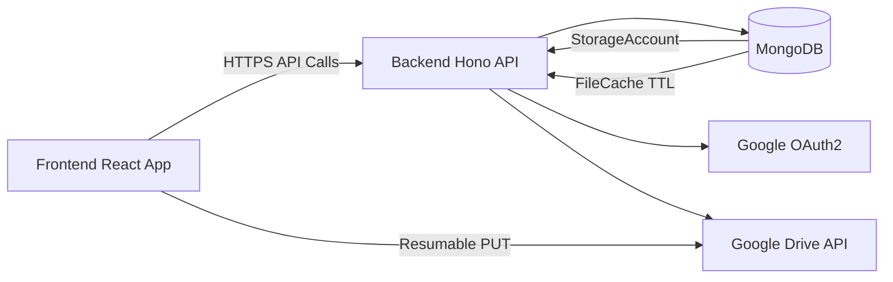
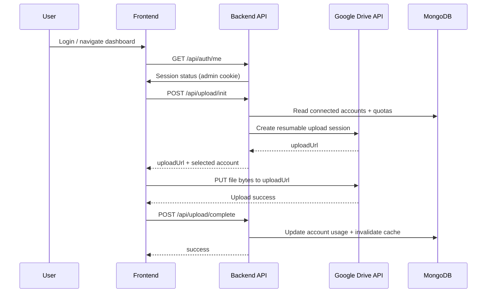

# My Cloud Service

My Cloud Service is a multi-account Google Drive management platform with:

- A backend API built with **Hono + TypeScript + MongoDB**
- A frontend admin dashboard built with **React + Vite + Zustand**

It supports account onboarding via Google OAuth2, unified file browsing across connected drives, resumable uploads, storage monitoring, metadata caching, and optional public upload flows.

## Key Features

- Google OAuth2 integration for connecting storage accounts
- Unified file view across multiple Google Drive accounts
- Resumable upload flow (backend issues upload URL, client uploads directly to Google)
- Upload modes:
  - **Private mode**: optional API key validation (`X-API-Key`)
  - **Public mode**: rate-limited uploads with optional auto-cleanup
- Cross-account storage monitoring and refresh
- MongoDB-based file metadata cache with TTL invalidation

## Architecture



## Request and Upload Flow



## Repository Structure

- `src/index.ts`  
  API bootstrap, middleware, route registration, DB connection, cleanup job startup
- `src/api/`  
  Route handlers: `auth.ts`, `accounts.ts`, `drive.ts`, `upload.ts`
- `src/lib/`  
  Google API client helpers, auth middleware, DB connector, cache, cleanup scheduler
- `src/models/`  
  MongoDB models (`StorageAccount`, `FileCache`)
- `frontend/`  
  React admin application (Drive, Monitoring, Recent, Shared, Trash)
- `docs/api_upload_guide.md`  
  Detailed upload integration guide

## Prerequisites

- Node.js 18+
- MongoDB (Atlas or local)
- Google Cloud OAuth credentials with Drive API enabled

## Environment Configuration

Create a backend `.env` file from `.env.example`.

Required:

- `PORT` (default: `3000`)
- `MONGODB_URI`
- `GOOGLE_CLIENT_ID`
- `GOOGLE_CLIENT_SECRET`
- `GOOGLE_REDIRECT_URI` (for example: `http://localhost:3000/api/auth/callback`)
- `FRONTEND_URL` (for example: `http://localhost:5173`)

Optional but recommended:

- `ADMIN_EMAIL` (admin identity during OAuth callback)
- `MASTER_FOLDER_ID` (centralized file listing/upload target)
- `PUBLIC_FOLDER_ID` (public upload destination + cleanup scope)
- `UPLOAD_API_KEY` (used by private upload mode)

Create a frontend env file from `frontend/.env.example`:

```env
VITE_API_URL=http://localhost:3000
```

## Local Development

### 1) Install dependencies

```bash
npm install
npm --prefix frontend install
```

### 2) Start backend

```bash
npm run dev
```

Default backend URL: `http://localhost:3000`

### 3) Start frontend

```bash
npm --prefix frontend run dev
```

Default frontend URL: `http://localhost:5173`

## Available Scripts

### Backend (root)

- `npm run dev` — run backend in watch mode
- `npm run build` — compile TypeScript to `dist`
- `npm run start` — run compiled backend
- `npm run typecheck` — type-check without emit

### Frontend (`frontend/`)

- `npm run dev`
- `npm run build`
- `npm run lint`
- `npm run preview`

## API Overview

Public/basic:

- `GET /`
- `GET /health`

Auth:

- `GET /api/auth/url`
- `GET /api/auth/callback`
- `GET /api/auth/me`
- `POST /api/auth/logout`

Accounts (admin cookie required):

- `GET /api/accounts`
- `GET /api/accounts/:id`
- `PATCH /api/accounts/:id`
- `DELETE /api/accounts/:id`
- `POST /api/accounts/:id/refresh`
- `POST /api/accounts/refresh-all`

Drive (admin cookie required):

- `GET /api/drive/files`
- `GET /api/drive/files/:id`
- `POST /api/drive/folders`
- `PATCH /api/drive/files/:id`
- `POST /api/drive/files/:id/move`
- `POST /api/drive/files/:id/trash`
- `DELETE /api/drive/files/:id`
- `POST /api/drive/files/bulk-trash`

Upload:

- `POST /api/upload/init`
- `GET /api/upload/status`
- `POST /api/upload/complete`

For upload integration details, see `docs/api_upload_guide.md`.

## Security Notes

- Current admin protection uses a simple cookie token (`admin_token`) via middleware.
- CORS origin is controlled by `FRONTEND_URL`.
- For production hardening, consider signed/secure cookies or JWT-based session validation, plus stricter cookie policies.

## Utility Scripts

- `clear_cache.ts` — clear all file cache entries in MongoDB
- `debug_master.ts` — inspect files reachable via `MASTER_FOLDER_ID`
